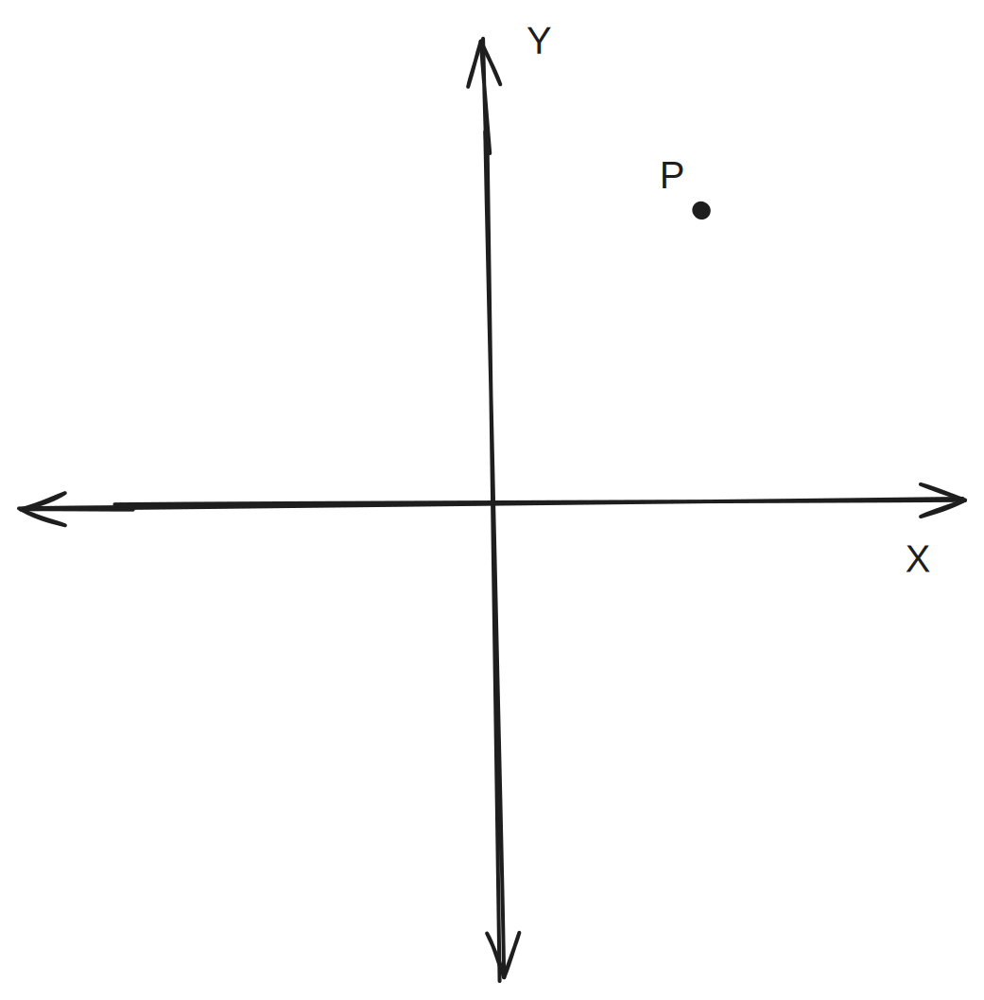
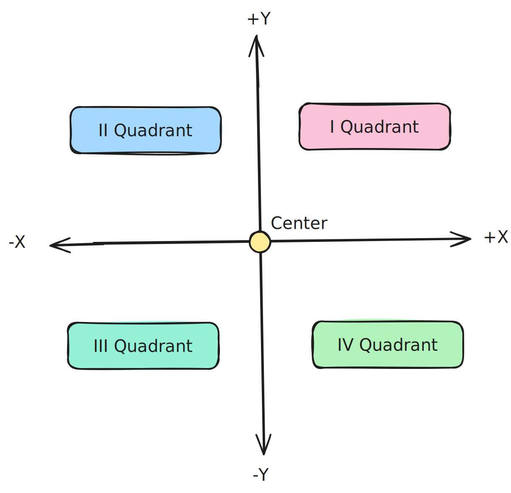
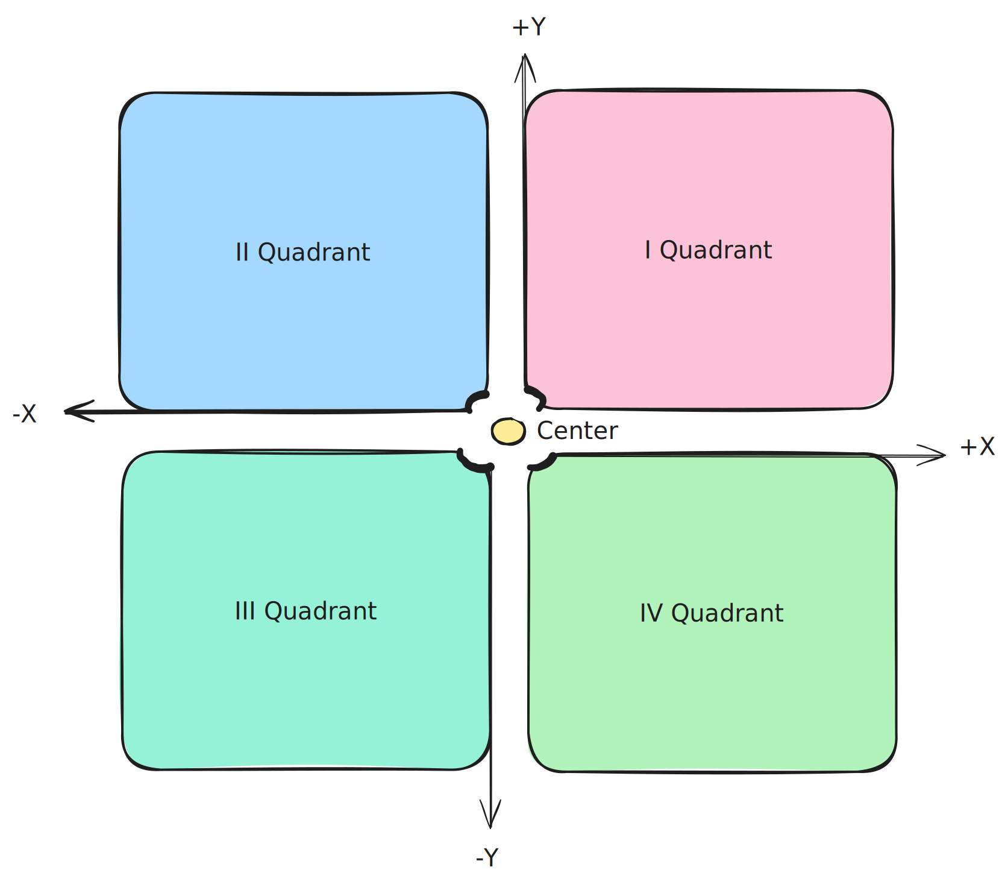

---
# try also 'default' to start simple
theme: default
# random image from a curated Unsplash collection by Anthony
# like them? see https://unsplash.com/collections/94734566/slidev
background: https://cover.sli.dev
# some information about your slides, markdown enabled
title: Introduction to Rust
info: |
  ## Slidev Starter Template
  Presentation slides for developers.

  Learn more at [Sli.dev](https://sli.dev)
# apply any unocss classes to the current slide
class: text-center
# https://sli.dev/custom/highlighters.html
highlighter: shiki
# https://sli.dev/guide/drawing
drawings:
  persist: false
# slide transition: https://sli.dev/guide/animations#slide-transitions
transition: slide-left
# enable MDC Syntax: https://sli.dev/guide/syntax#mdc-syntax
mdc: true
---

## Meetup: 
# Introduction to Rust

Discover the power of safe and efficient programming with Rust

<div class="pt-12">
  <span @click="$slidev.nav.next" class="px-2 py-1 rounded cursor-pointer" hover="bg-white bg-opacity-10">
    Press Space for next page <carbon:arrow-right class="inline"/>
  </span>
</div>

<div class="abs-br m-6 flex gap-2">
  <button @click="$slidev.nav.openInEditor()" title="Open in Editor" class="text-xl slidev-icon-btn opacity-50 !border-none !hover:text-white">
    <carbon:edit />
  </button>
  <a href="https://github.com/slidevjs/slidev" target="_blank" alt="GitHub" title="Open in GitHub"
    class="text-xl slidev-icon-btn opacity-50 !border-none !hover:text-white">
    <carbon-logo-github />
  </a>
</div>

<!--
The last comment block of each slide will be treated as slide notes. It will be visible and editable in Presenter Mode along with the slide. [Read more in the docs](https://sli.dev/guide/syntax.html#notes)
-->

---
src: ./pages/compiler-modern-devs.md
hide: false
---

---

# Point on a Plane

<div grid="~ cols-2 gap-2" m="t-2">


</div>

---

# Algebraic Typing

Structs

<div grid="~ cols-2 gap-2" m="t-2">
<div>
```rust
struct Point {
    x: f32,
    y: f32
}
```

Algebraic Typing can be seen as sets.
</div>


</div>
<br>

---
src: ./pages/immutability-b-default.md
hide: false
---


---

# Pattern Matching = Robustness

Enumerators and Traits

```rust
enum QuadrantNum {
    CENTER,
    I,
    II,
    III,
    IV
}

trait Quadrant {
    fn get_quadrant(self) -> QuadrantNum;
}
```

---

### Implementing **Quadrant** Trait
<br>

```rust
impl Quadrant for Point {
    fn get_quadrant(self) -> QuadrantNum {
        if self.x > 0.0 && self.y >= 0.0 {
            QuadrantNum::I
        } else if self.x <= 0.0 && self.y > 0.0 {
            QuadrantNum::II
				} else if self.x < 0.0 && self.y <= 0.0 {
            QuadrantNum::II
        } else if self.x >= 0.0 && self.y < 0.0 {
            QuadrantNum::IV
        } else {
            QuadrantNum::CENTER
        }
    }
}
```

---

# Pattern Matching = Robustness

`match` keyword

```rust
impl Point {
    fn show_quad(self) {
        match self.get_quadrant() {
            QuadrantNum::I => println!("Quadrant I"),
            QuadrantNum::II => println!("Quadrant II"),
            QuadrantNum::III => println!("Quadrant III"),
            QuadrantNum::IV => println!("Quadrant IV"),
            QuadrantNum::CENTER => println!("It's the origin"),
        }
    }
}
```

---
layout: center
class: text-center
---

# Owning and Security
# (Ownership & Borrow Checking)

## **fighting the borrow checker**

---
layout: center
class: text-center
---

# Heap and Stack

---
src: ./pages/metaprogramming.md
hide: false
---

---

# Poem and OpenAPI
Hello World in a Web Server

<br>

```rust
fn main() {
    println!("Hello, World!");
}
```

---

# Chat with `async-openai`

```rust
fn main() {
    println!("Hello, World!");
}
```

---
layout: center
---
# Gracias!

<style>
h1 {
  background-color: #2B90B6;
  background-image: linear-gradient(45deg, #4EC5D4 10%, #146b8c 20%);
  background-size: 100%;
  -webkit-background-clip: text;
  -moz-background-clip: text;
  -webkit-text-fill-color: transparent;
  -moz-text-fill-color: transparent;
}
</style>
